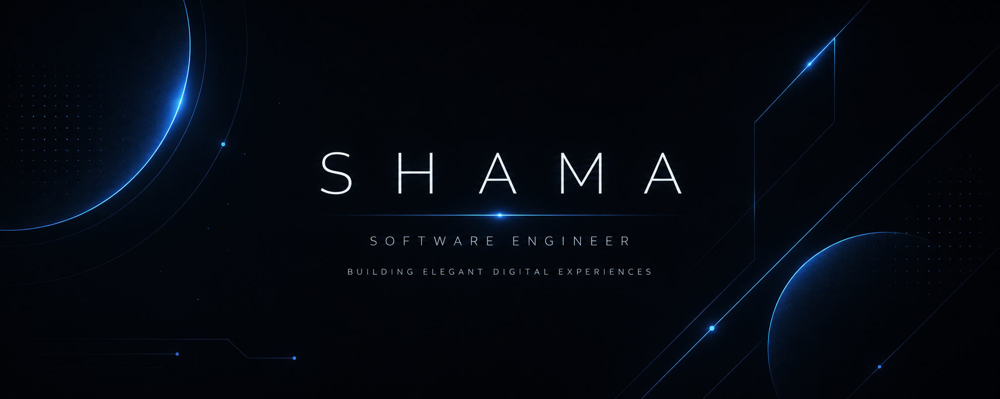
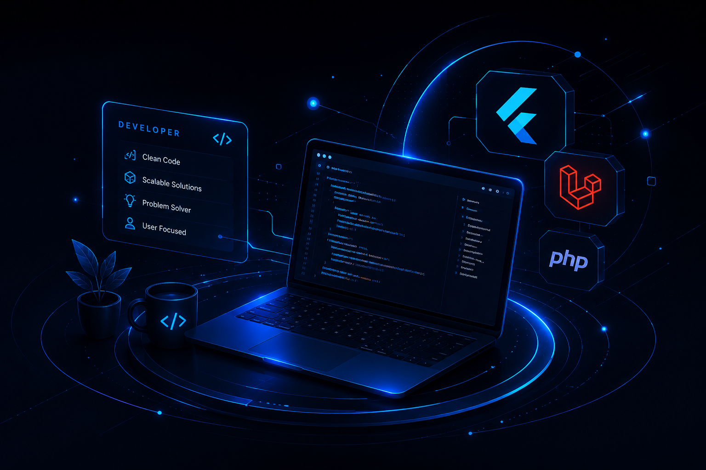

  

 

<table border="0" width="100%">
  <tr>
    <td width="58%" valign="middle" style="padding-right: 20px;">
      <h2>⚡ ABOUT</h2>
      

        Software Engineer passionate about building elegant, scalable, and user-focused digital products with <b>Flutter</b> and <b>Laravel</b>.
      

      

        I enjoy turning ideas into meaningful solutions that make a real impact.
      

    </td>
    <td width="42%" align="center" valign="middle">
      
    </td>
  </tr>
</table>

 
 

<h2>🚀 TECH STACK</h2>

  

 
 

<h2>✨ FEATURED PROJECTS</h2>

<table align="center" width="100%">
  <tr>
    <td width="33%" valign="top">
      <h3>🛒 E-Commerce Platform</h3>
      
Multi-vendor e-commerce system for electronic devices with real-time inventory sync and digital wallet.

      
🔹 <b>Laravel</b> &nbsp;•&nbsp; 🔹 <b>Flutter</b>

    </td>
    <td width="33%" valign="top">
      <h3>📦 Inventory Manager</h3>
      
Smart inventory management system with integration to local stores and accounting software.

      
🔹 <b>Laravel</b> &nbsp;•&nbsp; 🔹 <b>MySQL</b>

    </td>
    <td width="33%" valign="top">
      <h3>📱 Mobile Application</h3>
      
Cross-platform mobile app built with Flutter delivering smooth and modern user experience.

      
🔹 <b>Flutter</b> &nbsp;•&nbsp; 🔹 <b>Dart</b>

    </td>
  </tr>
</table>

 
 

<h2>📊 GITHUB STATS</h2>

  
  

 
 

<h2>📫 LET'S CONNECT</h2>

  
  &nbsp;&nbsp;&nbsp;&nbsp;&nbsp;&nbsp;
  

